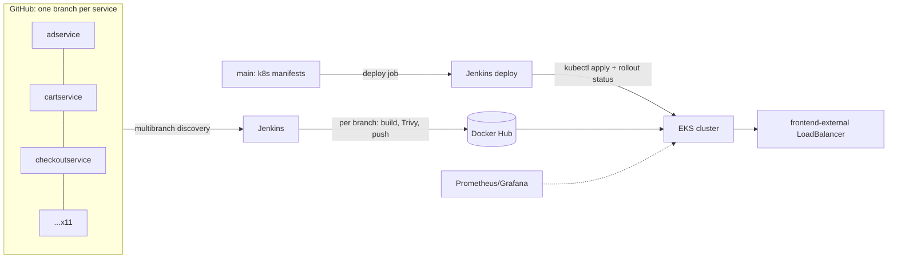

# Online Boutique on AWS EKS with per-service Jenkins pipelines

Eleven gRPC microservices (Go, C#, Node, Python, Java) built, scanned and deployed independently to an EKS cluster provisioned with Terraform.

> **What's mine and what isn't.** The application is Google's [Online Boutique](https://github.com/GoogleCloudPlatform/microservices-demo) (Apache 2.0), the standard multi-language microservices demo. I used it because eleven services in five languages is a realistic build matrix, and because nobody hiring for DevOps cares who wrote the cart service. The Terraform, the Jenkins multibranch setup, the per-service pipelines with image scanning, the RBAC for Jenkins, the deployment job with rollout verification, and the monitoring are my work. Service source code on the service branches is upstream, unmodified except for the Jenkinsfile.

## How it's organised



Jenkins multibranch scans the repo and creates one pipeline per branch. A push to `cartservice` builds only the cart service, scans it, and pushes `<handle>/cartservice:<gitsha>` and `:latest`. The deploy job on `main` applies the manifests and blocks until every Deployment's rollout completes, so a bad image fails the build rather than leaving crash-looping pods.

## Repository layout

```
main
├── terraform/     VPC, EKS 1.30, managed node group, EBS CSI (IRSA), Jenkins host
├── k8s/           Namespace + all 11 Deployments/Services with probes and resource limits
├── jenkins/       service.Jenkinsfile (template used on every branch) + branch updater
├── monitoring/    kube-prometheus-stack values
└── Jenkinsfile    deploy job: apply manifests, wait for rollouts
<service>          upstream source + Jenkinsfile (build -> Trivy -> push)
```

## Running it

```bash
cd terraform
cp terraform.tfvars.example terraform.tfvars    # ssh_key_name, allowed_cidr
terraform init && terraform apply               # ~15 min

# Jenkins: open the URL from terraform output, add credential dockerhub-cred,
# create a Multibranch Pipeline pointing at this repo. It discovers 12 branches.
# Build the 11 service branches once, then run the main-branch job to deploy.

aws eks update-kubeconfig --name online-boutique --region <region>
kubectl -n webapps get svc frontend-external    # public hostname
```

## Decisions and trade-offs

- **Branch-per-service, not repo-per-service.** Upstream is a monorepo; splitting into branches lets Jenkins multibranch give each service an isolated pipeline without eleven repositories to administer. On a client project with a real team I'd use a monorepo with path filters instead — branches-as-services makes cross-service changes awkward.
- **Trivy blocks on fixable CRITICALs only.** Unfixed CVEs in base images are logged, not blocking; otherwise nothing would ever ship.
- **Jenkins authenticates to EKS through its instance role (EKS access entry), not a stored service-account token.** The original tutorial pattern of pasting a long-lived kube token into Jenkins credentials is one leaked credential away from cluster admin.
- **Resource requests/limits on every container.** Upstream ships them; I kept them, because a cluster with eleven unbounded services is a noisy-neighbour problem waiting to happen.
- **`frontend-external` is a classic LoadBalancer Service.** Simple and enough for a demo. Production gets an ingress with TLS.

## What I'd change before calling this production

- ECR instead of Docker Hub, pulled via IRSA.
- Pin image tags in the manifests and have the deploy job update them (GitOps), instead of `:latest` + rollout restart.
- A staging namespace with the same manifests and a promotion step.
- Istio or Linkerd for mTLS between services — the annotations are already there upstream.
- Distributed tracing (the services already emit OpenTelemetry).

---

**Hammad Khalid** — DevOps Engineer · [GitHub](https://github.com/hammad558) · [LinkedIn](https://linkedin.com/in/hammad-khalid99)
